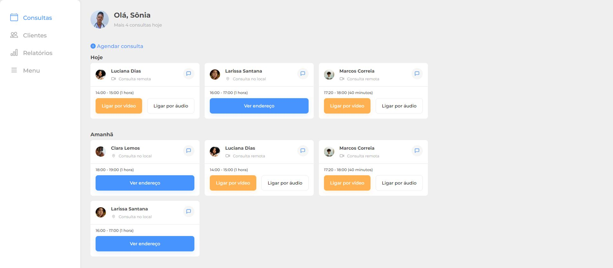

<h1 align="center" id="project_name">
  <br />          
   
   
   
  <br />
</h1>

<p align="center">
  Responsive Layout Mobile First with HTML, CSS and Javascript.
</p>

<p align="center">
  <!-- GitHub last commit -->
  <a href="https://github.com/risaltte/aluramed/commits/master">
    
  </a>
  <!-- GitHub language count -->
  
  <!-- GitHub top language -->
  
  <!-- Repository size -->
  
  <!-- Repository status -->
  
  <!-- Link repo -->
  <a href="https://github.com/risaltte/aluramed/blob/master/LICENSE">
    
  </a>
</p>

<p align="center">
 <a href="#about">About</a> •
 <a href="#layout">Layout</a> • 
 <a href="#technologies">Technologies</a> • 
 <a href="#prerequisites">Prerequisites</a> •
 <a href="#demo">Demo</a> •
 <a href="#author">Autor</a> • 
 <a href="#license">License</a>
</p>

<p align="center">
  
</p>

<h4 align="center">
  	🚧 7 Days of Code Aluramed | Done 🚧
</h4>

<h2 id="about">
💻 About
</h2>

7 Days of code Aluramed is a fictional Layout built to apply the knowledge of [Responsive Layout](https://www.w3schools.com/html/html_responsive.asp) and [Mobile First](https://medium.com/@Vincentxia77/what-is-mobile-first-design-why-its-important-how-to-make-it-7d3cf2e29d00).

Project developed during the challenge 7 Days of Code [Alura](https://www.alura.com.br/).

<h2 id="layout">🎨 Layout</h2>
<a href="https://www.figma.com/file/4OjHFmeHAgfX2JpRymOeA0/7days---Responsividade?node-id=6%3A622">
  
</a>
<p align="center" style="display: flex; align-items: flex-start; justify-content: center; flex-direction: column; gap: 16px;">
  

  
</p>

<br />
<h2 id="technologies">🛠 Technologies</h2>

The following tools were used in the construction of the project:

- **[HTML](https://reactjs.org/)**
- **[CSS](https://www.typescriptlang.org/)**
- **[Javascript](https://tailwindcss.com/)**

**Utilities**

- Icons: **[Bootstrap Icons](https://icons.getbootstrap.com/)**
- Fonts: **[Montserrat](https://fonts.google.com/specimen/Montserrat)**

<h2 id="prerequisites">💿 How to run the project</h2>

### 🧰 Prerequisites

Before you start, you will need to have the following tools installed on your machine:

> [Git](https://git-scm.com).
> In addition it is good to have an editor to work with the code as [VSCode](https://code.visualstudio.com/)
> Extension [Live Server](https://marketplace.visualstudio.com/items?itemName=ritwickdey.LiveServer) for VSCode

### 🧭 Running the Project

```bash
# Clone repo
$ git clone https://github.com/risaltte/aluramed.git

# Access the project folder in the terminal/cmd
$ cd aluramed

# Open project in VSCode
code .

```
Run the application in development mode with Live Server as in the example below:
  

See on http://localhost:5500/

<h2 id="demo">🧪 Demo</h2>
<a style="margin-left: 16px" href="https://risaltte.github.io/aluramed/" target="_blank">
<!-- Link externo ou local(.github). -->
    
</a>

<h2 id="author">🦸 Autor</h2>
<a href="https://github.com/risaltte">
 
 <br />
 <sub><b>Rafael Risalte</b></sub></a>

[](https://www.linkedin.com/in/rafaelrisalte/)
[](mailto:risaltte@gmail.com)

<h2 id="license">📝 License</h2>

Distributed under MIT license. See [LICENSE](LICENSE) for more information.

Made with ❤️ by Rafael Risalte 👋🏽 [Contact!](https://www.linkedin.com/in/rafaelrisalte/)

[⬆ Back to top](#project_name)<br />
